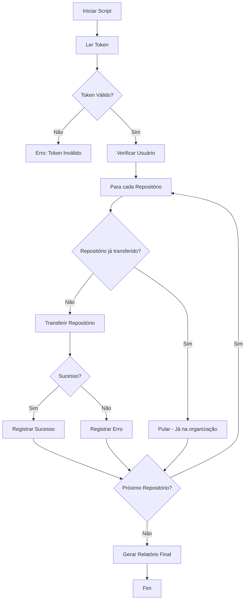
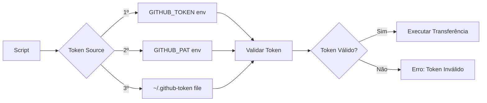

# 🚀 Scripts de Gerenciamento GitHub - NEO-FlowOFF

Ferramentas automatizadas para gerenciar repositórios GitHub e transferências entre organizações.

## 📋 Índice

- [Sobre](#-sobre)
- [Scripts Disponíveis](#-scripts-disponíveis)
- [Instalação](#-instalação)
- [Configuração](#-configuração)
- [Uso](#-uso)
- [Documentação](#-documentação)
- [Solução de Problemas](#-solução-de-problemas)

## 📖 Sobre

Este conjunto de scripts facilita o gerenciamento de repositórios GitHub, incluindo:

> **💡 Destaque**
> Ferramentas automatizadas para transferir e gerenciar repositórios entre contas e organizações GitHub.

- ✅ Transferência automatizada de repositórios entre contas/organizações
- ✅ Verificação de permissões e acesso
- ✅ Diagnóstico de problemas de autenticação
- ✅ Validação de configurações

## 🛠️ Scripts Disponíveis

### `transfer-repos.js`

Script principal para transferir repositórios do perfil pessoal para a organização **NEO-FlowOFF**.

<details>
<summary><strong>Ver funcionalidades completas</strong></summary>

**Funcionalidades:**
- ✅ Verifica automaticamente se repositórios já foram transferidos
- ✅ Suporta múltiplos repositórios em lote
- ✅ Exibe progresso em tempo real
- ✅ Gera relatório final detalhado
- ✅ Tratamento robusto de erros
- ✅ Suporte a múltiplas fontes de autenticação
- ✅ Rate limiting automático

**Fluxo de Execução:**
1. Valida token de autenticação
2. Verifica status de cada repositório
3. Transfere apenas repositórios pendentes
4. Gera relatório final
</details>

### `check-github-access.js`

Script de diagnóstico para verificar:

<details>
<summary><strong>Ver funcionalidades de diagnóstico</strong></summary>

- ✅ Validade do token de autenticação
- ✅ Permissões do token (escopos)
- ✅ Acesso à organização
- ✅ Status de cada repositório
- ✅ Permissões disponíveis por repositório
- ✅ Identificação de problemas de configuração

**Quando usar:**
- Antes de executar transferências
- Para diagnosticar erros de autenticação
- Para verificar permissões do token
- Para validar acesso à organização
</details>

## 🔧 Instalação

### Pré-requisitos

- **Node.js** 14.x ou superior
- **npm** ou **yarn**
- Conta GitHub com acesso aos repositórios

### Configuração Inicial

1. Clone ou baixe os scripts para seu diretório local:

```bash
cd ~
# Os scripts devem estar em: ~/transfer-repos.js e ~/check-github-access.js
```

2. Torne os scripts executáveis:

```bash
chmod +x transfer-repos.js
chmod +x check-github-access.js
```

## ⚙️ Configuração

### 1. Criar Personal Access Token (PAT)

<details>
<summary><strong>Passo a passo para criar o token</strong></summary>

1. Acesse [GitHub Settings → Tokens](https://github.com/settings/tokens)
2. Clique em **"Generate new token"** → **"Generate new token (classic)"**
3. Configure:
   - **Nome**: `NEO-FlowOFF Transfer Scripts`
   - **Expiração**: Escolha conforme necessário
   - **Escopos necessários**:
     - ✅ `repo` (acesso completo aos repositórios)
     - ✅ `admin:org` (administração de organizações)

4. Clique em **"Generate token"**
5. ⚠️ **Copie o token imediatamente** (não será exibido novamente)

> **🔒 Importante**
> O token tem permissões administrativas. Mantenha-o seguro e nunca o compartilhe publicamente.
</details>

### 2. Configurar o Token

**Opção A: Arquivo de Configuração (Recomendado)**

```bash
echo "GITHUB_TOKEN=seu_token_aqui" > ~/.github-token
chmod 600 ~/.github-token
```

**Opção B: Variável de Ambiente**

Adicione ao seu `~/.zshrc` ou `~/.bashrc`:

```bash
export GITHUB_TOKEN=seu_token_aqui
```

Depois recarregue:

```bash
source ~/.zshrc  # ou source ~/.bashrc
```

## 🚀 Uso

### Transferir Repositórios

Execute o script principal:

```bash
node transfer-repos.js
```

### Fluxo de Execução



### Diagrama de Autenticação



**Exemplo de saída:**

```
🚀 Iniciando transferência de repositórios...

📦 Origem: neomello
🏢 Destino: NEO-FlowOFF
📋 Repositórios: 9

✅ Token válido - Usuário: neomello

==================================================

✅ flwff_dao já está na organização NEO-FlowOFF
✅ flowcloser-agent já está na organização NEO-FlowOFF
...

==================================================
📊 RESUMO DA TRANSFERÊNCIA

✅ Sucesso: 9/9
==================================================
```

### Verificar Acesso

Execute o script de diagnóstico:

```bash
node check-github-access.js
```

Este script verifica:
- Validade do token
- Permissões disponíveis
- Acesso à organização
- Status de cada repositório

## 📚 Documentação

### Repositórios Gerenciados

Os seguintes repositórios são gerenciados por estes scripts:

| # | Repositório | Status |
|---|-------------|--------|
| 1 | `flwff_dao` | ✅ Transferido |
| 2 | `flowcloser-agent` | ✅ Transferido |
| 3 | `flowpay_lite` | ✅ Transferido |
| 4 | `flowcloser` | ✅ Transferido |
| 5 | `flowpay_landing` | ✅ Transferido |
| 6 | `agent-neo-flowoff` | ✅ Transferido |
| 7 | `flow25` | ✅ Transferido |
| 8 | `evolution-flow` | ✅ Transferido |
| 9 | `flowoffmkt` | ✅ Transferido |

### Estrutura dos Scripts

```
~/scripts-github/
├── transfer-repos.js          # Script principal de transferência
├── check-github-access.js      # Script de diagnóstico
├── README.md                   # Esta documentação
└── .github-token               # Arquivo de configuração (não versionado)
```

## 🔍 Solução de Problemas

<details>
<summary><strong>❌ Erro: "Token não configurado"</strong></summary>

**Sintomas:**
```
❌ Erro: Variável de ambiente GITHUB_TOKEN não configurada
```

**Soluções:**
1. Verifique se o arquivo `~/.github-token` existe:
   ```bash
   ls -la ~/.github-token
   ```

2. Verifique se a variável `GITHUB_TOKEN` está definida:
   ```bash
   echo $GITHUB_TOKEN
   echo $GITHUB_PAT
   ```

3. Crie o arquivo de token se não existir:
   ```bash
   echo "GITHUB_TOKEN=seu_token_aqui" > ~/.github-token
   chmod 600 ~/.github-token
   ```
</details>

<details>
<summary><strong>❌ Erro: "Forbidden" (403)</strong></summary>

**Sintomas:**
```
⚠️  [repo] - Sem permissão (verifique o token)
```

**Possíveis causas:**
- Token sem permissões suficientes
- Token associado à conta errada
- Sem acesso de administrador na organização

**Soluções:**
1. Execute diagnóstico:
   ```bash
   node check-github-access.js
   ```

2. Verifique as permissões do token em [GitHub Settings](https://github.com/settings/tokens)

3. Crie um novo token com permissões:
   - ✅ `repo` (todos)
   - ✅ `admin:org` (todos)
</details>

<details>
<summary><strong>❌ Erro: "Repository not found" (404)</strong></summary>

**Sintomas:**
```
⚠️  [repo] não encontrado ou sem permissão
```

**Possíveis causas:**
- Repositório não existe
- Nome do repositório incorreto (case-sensitive)
- Sem acesso ao repositório

**Soluções:**
1. Verifique se o repositório existe:
   ```bash
   curl -H "Authorization: token $GITHUB_TOKEN" \
     https://api.github.com/repos/neomello/[nome-do-repo]
   ```

2. Confirme o nome exato do repositório (GitHub é case-sensitive)

3. Verifique suas permissões no repositório
</details>

<details>
<summary><strong>❌ Erro: "Organization not found"</strong></summary>

**Soluções:**
1. Verifique se a organização existe: `https://github.com/NEO-FlowOFF`
2. Confirme que você é membro/administrador da organização
3. Verifique a grafia do nome (case-sensitive)
4. Execute diagnóstico:
   ```bash
   node check-github-access.js
   ```
</details>

<details>
<summary><strong>⚠️ Rate Limiting</strong></summary>

**Sintomas:**
```
❌ API rate limit exceeded
```

**Soluções:**
O script já inclui:
- ⏱️ Delay de 1 segundo entre requisições
- 🔄 Tratamento automático de erros

**Se ainda ocorrer:**
1. Aguarde alguns minutos
2. Execute novamente o script
3. Verifique limite atual:
   ```bash
   curl -H "Authorization: token $GITHUB_TOKEN" \
     https://api.github.com/rate_limit
   ```
</details>

## 📝 Notas Importantes

### Após Transferência

1. **Atualizar Remotes Locais:**

```bash
cd [nome-do-repo]
git remote set-url origin https://github.com/NEO-FlowOFF/[nome-do-repo].git
```

2. **Reconfigurar:**
   - 🔗 Webhooks
   - 🔑 Deploy keys
   - ⚙️ CI/CD pipelines
   - 🔐 Secrets e variáveis de ambiente

### Segurança

> **⚠️ Aviso Crítico**
> O arquivo `.github-token` contém credenciais sensíveis e **NUNCA** deve ser commitado no Git.

<details>
<summary><strong>Boas práticas de segurança</strong></summary>

- ✅ **Nunca** commite o arquivo `.github-token` no Git
- ✅ **Nunca** compartilhe seu token publicamente
- ✅ Use permissões mínimas necessárias
- ✅ Revise tokens periodicamente
- ✅ Revogue tokens não utilizados
- ✅ Use `chmod 600` no arquivo de token
- ✅ Adicione `.github-token` ao `.gitignore`
- ✅ Rotacione tokens regularmente
</details>

> **💡 Dica**
> Configure o `.gitignore` para garantir que o token nunca seja commitado acidentalmente:
> ```bash
> echo ".github-token" >> .gitignore
> ```

## 🔗 Links Úteis

- [Documentação GitHub - Transferir Repositório](https://docs.github.com/pt/repositories/creating-and-managing-repositories/transferring-a-repository)
- [GitHub API - Transfer Repository](https://docs.github.com/en/rest/repos/repos#transfer-a-repository)
- [GitHub - Sintaxe Markdown](https://docs.github.com/pt/get-started/writing-on-github/getting-started-with-writing-and-formating-on-github/basic-writing-and-formating-syntax)
- [GitHub - Personal Access Tokens](https://docs.github.com/pt/authentication/keeping-your-account-and-data-secure/creating-a-personal-access-token)

## 📄 Licença

Este projeto é de uso interno para gerenciamento de repositórios da organização NEO-FlowOFF.

## 👤 Autor

**Mellø** - Organização NEO-FlowOFF

---

**Última atualização:** 2025-01-27

